# File API

## ToDo

- [x] Service path resolve pattern: `/file/{localSystemFilePath}`
- [ ] Support query parameter: orderBy, orderByDirection, filterByName
- [x] GET file: Return file or not found
- [x] GET directory: List folder or not found
- [x] POST file: Upload file if file not exist
- [x] PATCH file: Update file if file exist
- [x] DELETE file: Delete file if file exist
- [ ] Unit test
- [x] Run by docker compose
- [ ] Async IO

## Set up

- `docker-compose up`

## Try CRUD

- import `fileAPI.postman_collection.json` into postman.
- Execute APIs one by one from top to bottom.
- **The POST and PATCH API need to update file in person.**

## Result

- Get file folder
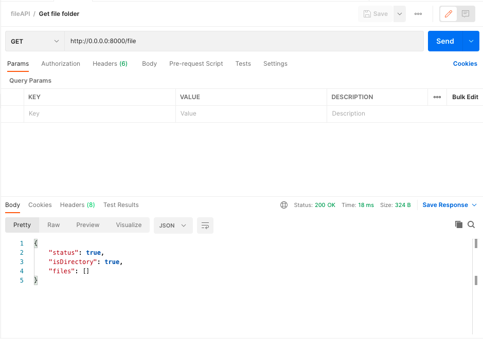

- Post test.txt
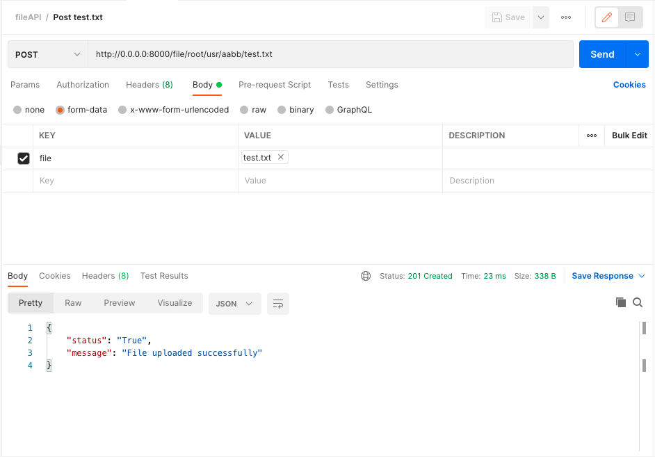

- Post REAME.md
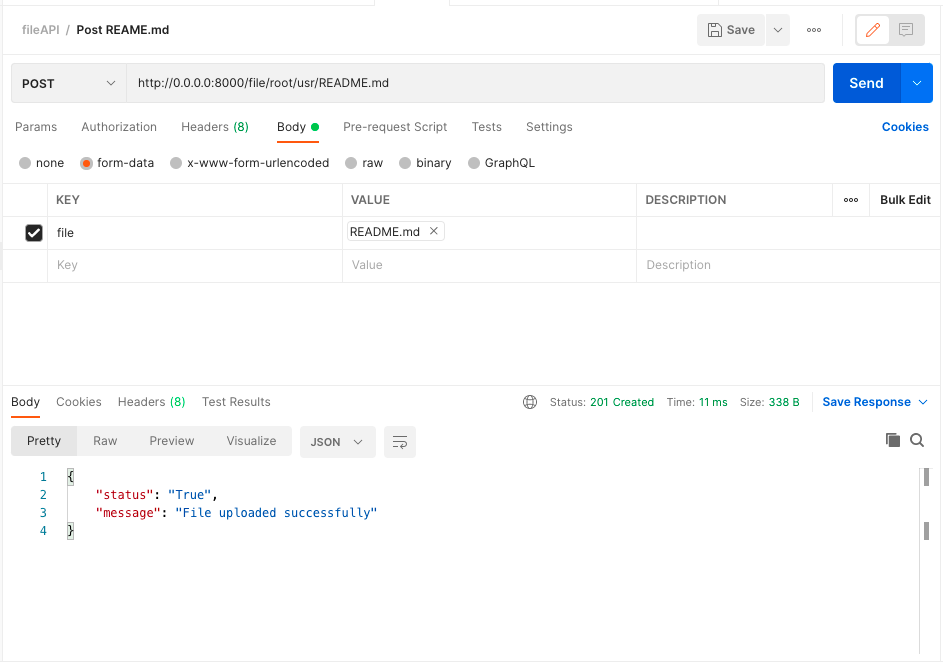

- Get root/usr folder
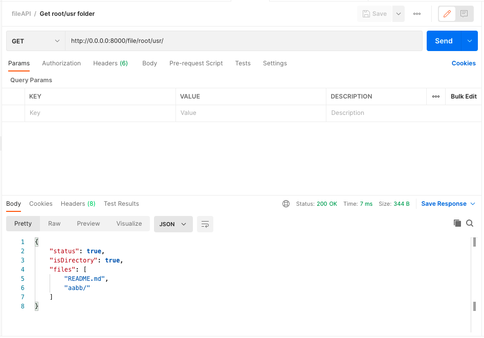

- Get test.txt
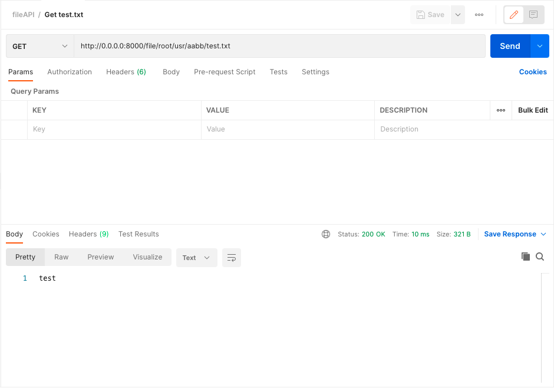

- Patch test.txt
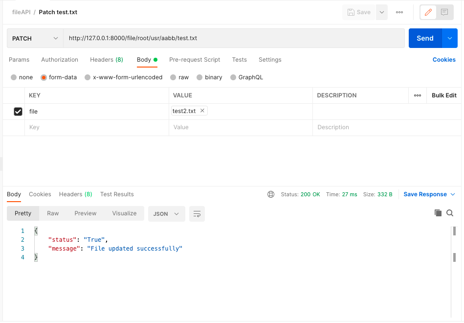

- Get test.txt
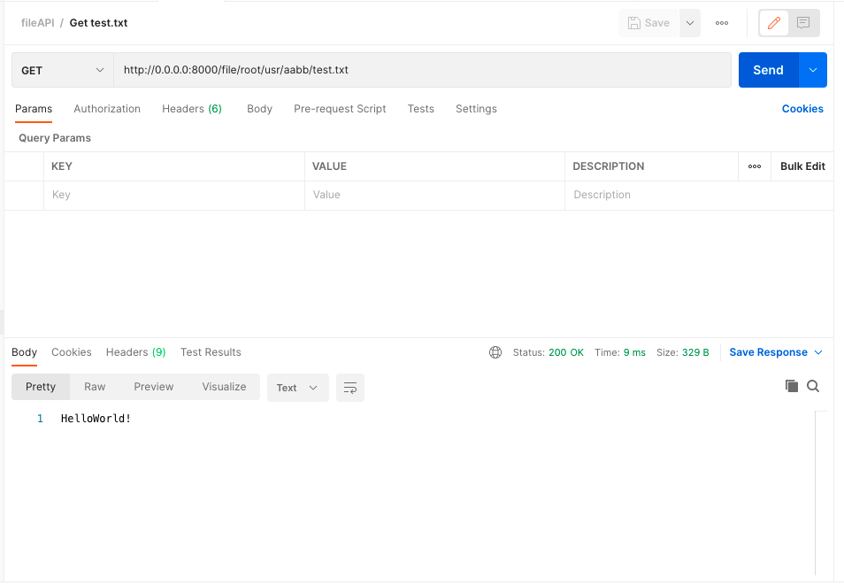

- Delete test.txt
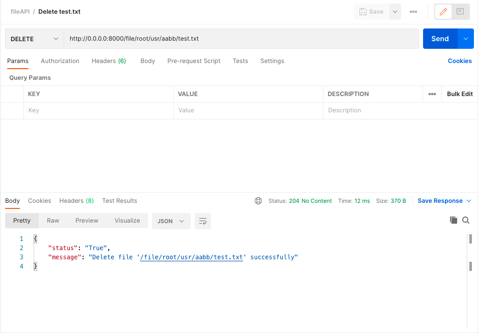

- Get test.txt
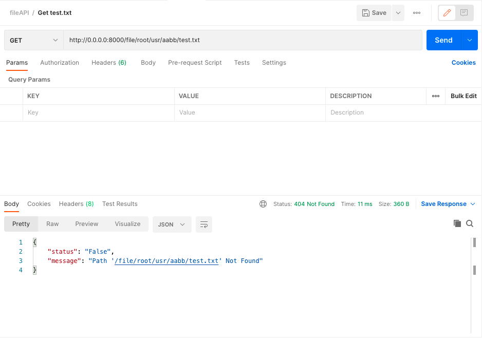

- Get root/usr/aabb folder
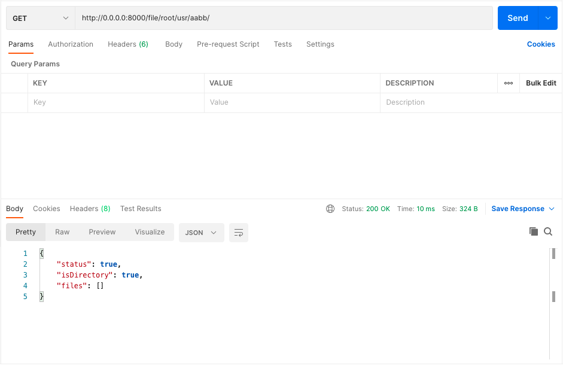

- Terminal
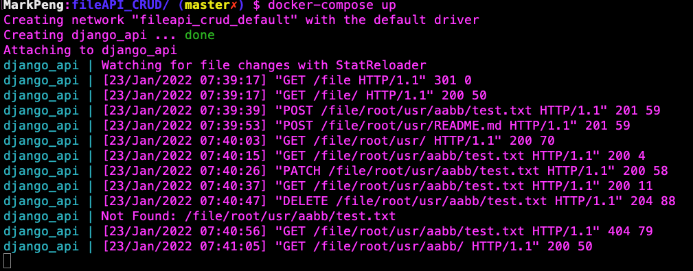